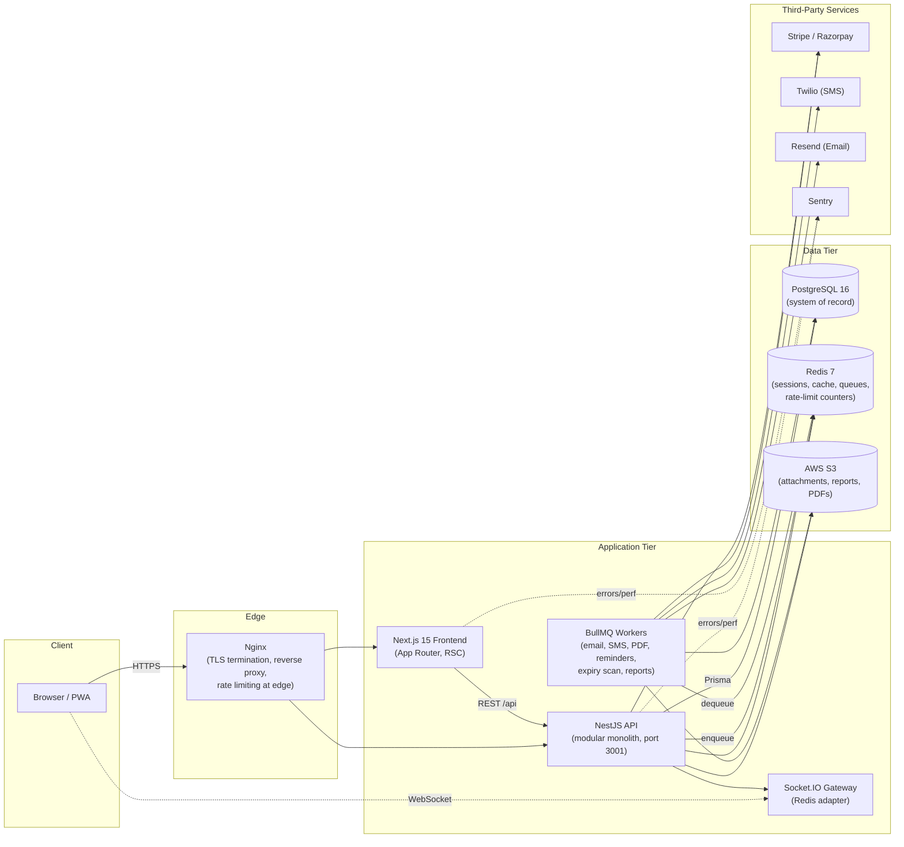
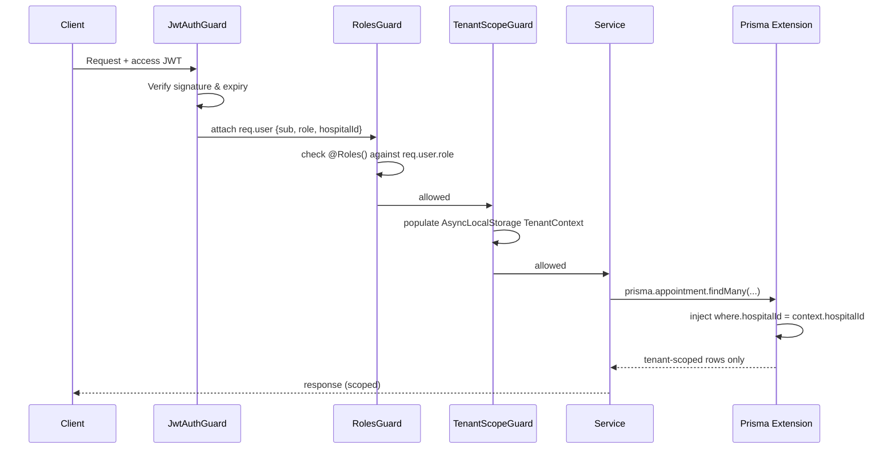
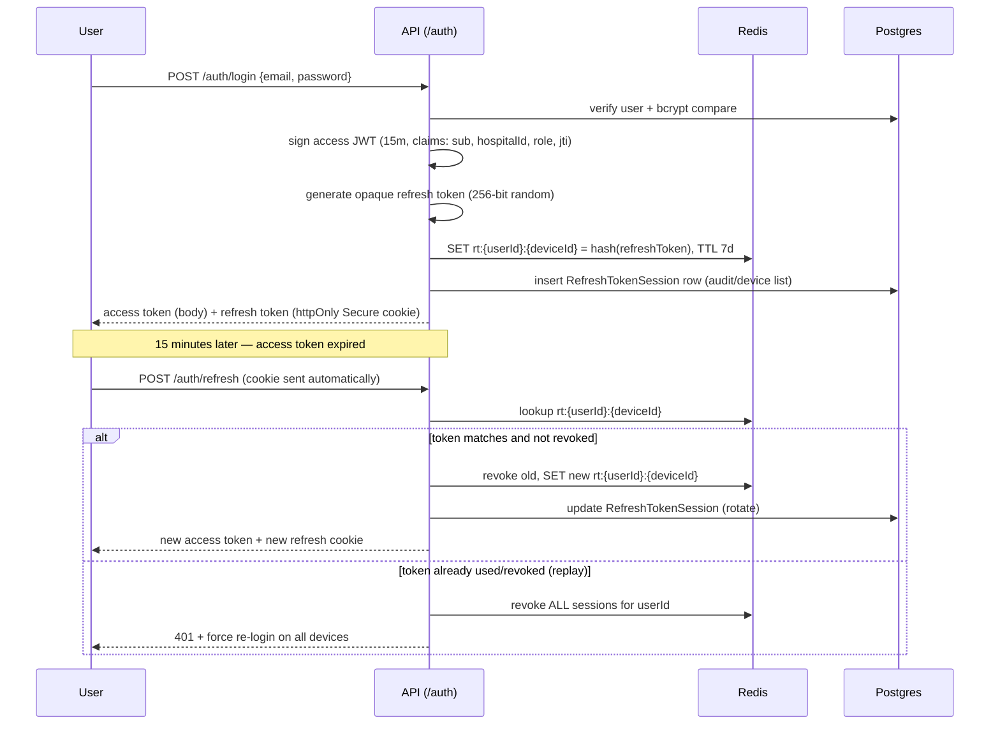
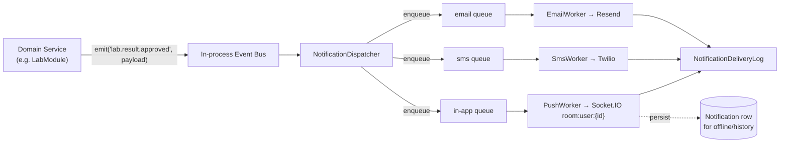
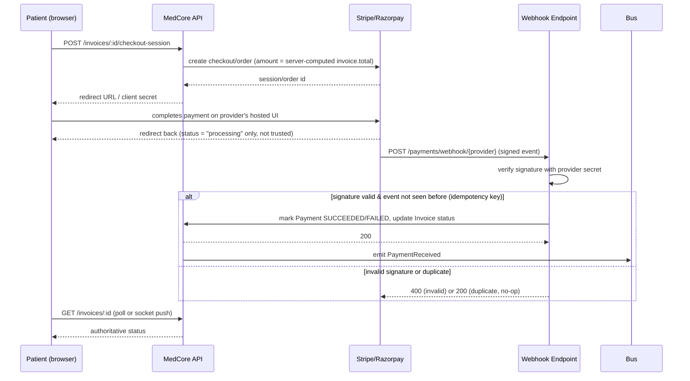
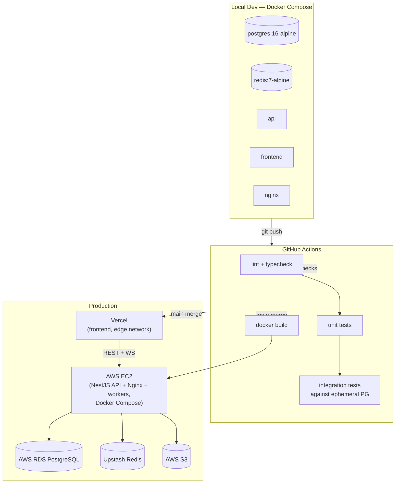

# Architecture Document — MedCore HMS

**Version:** 1.0
**Status:** Approved for Phase 1
**Related documents:** `02-SRS.md`, `06-DATABASE-DESIGN.md`, `09-SECURITY.md`, `11-DECISIONS.md`

## 1. System Architecture

A layered, modular-monolith backend (NestJS) behind Nginx, serving a Next.js frontend, with PostgreSQL as the system of record, Redis for cache/sessions/queues, S3 for files, and Socket.IO for real-time push. Background work runs in BullMQ workers sharing the Redis instance. This is a monolith by design, not microservices — a solo developer building an advanced-but-time-boxed system benefits far more from strong module boundaries inside one deployable than from the operational tax of distributed services (see `11-DECISIONS.md` D-003).



## 2. Frontend Architecture

Next.js 15 App Router with a strict split between Server Components (data-heavy, read-mostly views — patient lists, analytics, record detail) and Client Components (interactive widgets — forms, modals, calendars, charts). State is layered:

- **Server state** (anything fetched from the API): TanStack Query — owns caching, refetch, optimistic updates.
- **Client-only UI state** (sidebar collapse, theme, active tab, auth identity mirror): Zustand, one small store per domain (`authStore`, `notificationStore`, `uiStore`) — never one monolithic store.
- **Form state**: React Hook Form + Zod schemas shared where possible with backend DTOs via `packages/types`.

Folder structure and component strategy are detailed in `04-UI-UX.md`.

**As implemented in Phase 12** (the patient portal, `11-DECISIONS.md` D-038):
- Folders follow the brief: `app/(auth)` (login, register, verify-email, forgot/reset password), `app/(portal)/portal/*`, `app/(dashboard)/staff` (a plain notice until Phase 13), `components/ui` (shadcn-style Radix primitives), `components/shared` (StatusBadge, EmptyState/ErrorState/ListSkeleton, PageHeader, ConfirmDialog, Pagination, FormField, Toaster, DownloadButton, StepIndicator), `components/modules` (SlotPicker, AppointmentCard, NotificationPanel, auth forms), `hooks` (`useAuth`, `useRealtime`, `useHospital`, `useDebounce`), `services` (API calls and TanStack Query hooks), `store` (`authStore`, `notificationStore`, `uiStore`), `lib`, `constants`.
- Portal pages are Client Components: every portal read needs the in-memory access token, which a Server Component can't see. Server Components would need the token in a cookie readable by the Next server, which D-038 rejects.
- `lib/api-client.ts` unwraps the envelopes, maps error codes, and refreshes once on a 401 (single-flight in a tab, Web Lock across tabs). The browser calls the API origin directly with credentials.
- `useRealtime` connects to `/notifications` with the current token on every (re)connect and invalidates the affected queries when a notification arrives.
- All times are shown in the hospital's timezone (from `/auth/me`), whatever the device's zone (D-037).

**As implemented in Phase 13** (the staff workspace, D-040):
- `app/(dashboard)/dashboard/*` shares the portal's `AppShell` (`components/modules/app-shell.tsx`). Navigation per role comes from `components/modules/staff-nav.ts`, and a page outside a role's navigation shows a plain refusal (`RoleGate`) instead of firing a request the API would reject.
- `/dashboard` renders one dashboard per role, each loaded as its own chunk (`next/dynamic`), so only the roles with charts download Recharts (first load 122 kB, down from 304 kB).
- Lists use the shared `DataTable` (sticky header, server pagination, loading/empty/error states) with filters kept in the URL (`useUrlFilters`), so dashboard "view all" links open pre-filtered lists.
- Chart data transforms are plain functions (`lib/chart-data.ts`); every chart has a text summary in its `figcaption`.

**As implemented in Phase 13B** (staff workflow screens, D-041):
- Each workflow is a screen under `app/(dashboard)/dashboard/` (patients, appointments, encounters, lab orders, prescriptions, medicines, invoices, staff, departments, settings), reached from the sidebar or from a row in a Phase 13 list or dashboard panel.
- Reads and writes live in `services/workflows.ts` (TanStack Query). Each mutation invalidates the query families its result can change, so a dispense refreshes the queue, stock, and bill views.
- The encounter workspace is assembled from panels in `components/modules/encounter/` (start form, vitals, addenda and allergies, prescribing, lab ordering).
- Screens reached from a list are listed with their roles in `WORKFLOW_ACCESS` (`staff-nav.ts`) for `RoleGate`. Which buttons a role sees comes from pure helpers that mirror the API's rules (`lib/appointment-actions.ts`, `lib/dispense.ts`). None of this is security; the API enforces every rule.
- Form schemas mirror the backend DTOs (`lib/staff-validation.ts`); every consequential action goes through `ConfirmDialog` (`04-UI-UX.md` §8).
- Browser uploads (attachments, signature) check type and size against the API's allow-lists (`lib/upload.ts`), declare the file to the API, then PUT the bytes to the returned pre-signed URL. That needs a bucket CORS rule for the web origin: the dev bucket gets it at API start, a production bucket from infrastructure (D-042).

## 3. Backend Architecture

NestJS organised as one feature module per bounded context, each independently testable with no circular imports:

```
AuthModule · UsersModule · HospitalsModule · DepartmentsModule
DoctorsModule · PatientsModule · AppointmentsModule · MedicalRecordsModule
PrescriptionsModule · PharmacyModule · LabModule · BillingModule
NotificationsModule · AnalyticsModule · AuditModule · HealthModule
```

Cross-cutting concerns are implemented once and applied globally:

- **Guards:** `JwtAuthGuard` (authentication) → `RolesGuard` (RBAC) → `TenantScopeGuard` (tenancy) run in that order on every protected route via a global `APP_GUARD` chain.
- **Interceptors:** response-envelope interceptor (wraps all success responses in the standard shape), logging interceptor (structured request logs with correlation ID), log-sanitiser.
- **Pipes:** global `ValidationPipe` with `class-validator`/`class-transformer` DTOs, whitelist + forbid-non-whitelisted enabled (extra fields in a request body are rejected, not silently dropped or accepted).
- **Filters:** a global exception filter normalises every thrown error (including Prisma errors) into the standard error envelope, stripping internals.

Each module exposes a thin controller, a service holding business rules, and — where the module owns tenant-scoped models — a repository that is the _only_ code path allowed to call Prisma for those models (this is what makes `FR-TENANT-002` enforceable by review, not just convention).

## 4. Database Architecture

Full schema in `06-DATABASE-DESIGN.md`. Summary of engine-level decisions:

- PostgreSQL 16, accessed exclusively through Prisma; no `$queryRawUnsafe` with interpolated values anywhere in the codebase (parameterised raw queries only where Prisma's query builder genuinely cannot express something, e.g. the exclusion constraint DDL).
- `btree_gist` extension enabled to support `EXCLUDE` constraints for appointment overlap prevention (§8).
- Soft deletes (`deletedAt`) on `Patient`, `Doctor`/`DoctorProfile`, `Appointment`, `Medicine` — never a hard delete of anything that touches clinical or financial history.
- Every write to a domain entity is mirrored to `AuditLog` via a Prisma Client Extension that intercepts `create`/`update`/`delete` on audited models, rather than by manually calling an audit function in every service (reduces the chance a developer forgets it).

## 5. Multi-Tenancy Architecture

Row-level multi-tenancy: every hospital-scoped table carries `hospitalId`. Isolation is enforced in three independent layers so that a bug in any single layer cannot cause a cross-tenant leak:

1. **Automatic query scoping** — a Prisma Client Extension reads the current request's `hospitalId` from an `AsyncLocalStorage`-backed `TenantContext` (populated by `TenantScopeGuard` immediately after JWT verification) and injects `where: { hospitalId }` into every `find*`/`update*`/`delete*` call, and sets `hospitalId` on every `create`, for models flagged tenant-scoped.
2. **Explicit service-layer checks** — services that load an entity by ID re-verify `entity.hospitalId === context.hospitalId` before returning or mutating it, as a second independent check (defence in depth; catches the case where a raw ID from one tenant is passed into a code path for another).
3. **Test-enforced regression gate** — tenancy-isolation integration tests run in CI on every PR and are treated as a release-blocking category, per `10-TESTING-STRATEGY.md` — a failure here blocks merge, full stop.

Super Admin is the sole exception: `TenantScopeGuard` allows a null tenant scope only when `role === SUPER_ADMIN` **and** the target route carries an explicit `@BypassTenantScope()` marker — an unmarked route stays tenant-scoped even for a Super Admin caller, so cross-tenant access is always an opt-in decision made once, at the route, not an emergent property of a powerful role.



## 6. Authentication Architecture



Full detail — password policy, OTP flows, rate limiting — in `09-SECURITY.md`.

## 7. Real-Time & Notification Architecture

Domain services never call a notification provider directly. They raise a typed domain event (`AppointmentConfirmed`, `LabResultApproved`, …) via an in-process event emitter after the triggering transaction commits. A `NotificationDispatcher` listens for these events and enqueues one BullMQ job per channel the event's trigger-table maps to (`03-ARCHITECTURE.md` reuses the table from `02-SRS.md` §FR-NOTIF). Each channel has its own queue and worker (`EmailWorker`, `SmsWorker`, `PushWorker`) so a Twilio outage degrades SMS delivery only, never blocking email or in-app notifications for the same event.



In-app delivery additionally persists a `Notification` row so a client that connects later (or a different device) can fetch unread history via `GET /notifications/me`, not only receive live pushes.

**As built (Phase 11, `docs/11-DECISIONS.md` D-032/D-033):**
- The "domain event" is recorded *inside the triggering transaction* as `Notification` rows (a transactional outbox, one row per recipient, idempotent via `dedupeKey`).
- The in-process bus (`@nestjs/event-emitter`) carries a post-commit `notifications.committed` signal. `NotificationDispatcher` then drains undispatched rows into the `email`/`sms`/`in-app` queues, with job id `<notificationId>-<channel>`.
- A `notification-outbox` sweep every 30s recovers any row whose signal was lost.
- The trigger table lives in code (`src/notifications/notification-triggers.ts`) and mirrors brief §7.8.
- The Socket.IO server uses the `@socket.io/redis-adapter` (configured in `ConfiguredIoAdapter`), so a push from any instance's worker reaches the user's socket on any other instance.
- OTP and password-reset messages are not notifications. They're sent directly and synchronously, never persisted or queued.

## 8. Appointment Booking Concurrency

**Decision:** PostgreSQL `EXCLUDE` constraint using the `btree_gist` extension, not application-level optimistic retry alone. Full reasoning in `11-DECISIONS.md` D-005.

Two exclusion constraints on `Appointment`, both scoped to active statuses only (`status NOT IN ('CANCELLED','NO_SHOW')`):

```sql
ALTER TABLE "Appointment" ADD CONSTRAINT no_doctor_overlap
  EXCLUDE USING gist (
    "doctorId" WITH =,
    tsrange("scheduledStart", "scheduledEnd") WITH &&
  ) WHERE (status NOT IN ('CANCELLED', 'NO_SHOW'));

ALTER TABLE "Appointment" ADD CONSTRAINT no_patient_overlap
  EXCLUDE USING gist (
    "patientId" WITH =,
    tsrange("scheduledStart", "scheduledEnd") WITH &&
  ) WHERE (status NOT IN ('CANCELLED', 'NO_SHOW'));
```

This makes double-booking impossible at the storage engine level, independent of how many API instances are running concurrently. The service layer still performs an availability pre-check (reads `DoctorAvailability` minus existing bookings) so the _common_ case returns a friendly `SLOT_UNAVAILABLE` error before hitting the database — the constraint is the correctness guarantee; the pre-check is the UX nicety. The concurrency test in `10-TESTING-STRATEGY.md` fires two simultaneous booking requests at the same slot and asserts exactly one `201` and one `409 SLOT_UNAVAILABLE`.

## 9. Payment Architecture

Client never reports payment success to the server as a trusted fact. The flow:



Idempotency is enforced by a unique constraint on `Payment.providerEventId`; a redelivered webhook is a no-op, never a double credit.

**As implemented in Phase 10** (`11-DECISIONS.md` D-029/D-030):
- The checkout step first creates a `PENDING` `Payment` for the server-computed balance, sends its id in the provider metadata, and stores the provider's checkout reference in `providerEventId`.
- The webhook settles it through a conditional `PENDING → SUCCEEDED/FAILED` update under the invoice row lock, so duplicate or concurrent deliveries apply funds exactly once, and the invoice status is re-derived from the sum of succeeded payments.
- The raw request body is captured for `/api/payments/webhook/*` only (`configureApp`).
- `PaymentReceived` is currently a persisted `PAYMENT_RECEIVED` `Notification` row; the event bus is Phase 11.

## 10. Storage & File Architecture

All uploads (EMR attachments, lab report PDFs, prescription PDFs, receipts, doctor signatures) go to a private S3 bucket. The API never proxies file bytes for large files — it issues short-lived pre-signed PUT URLs for upload and pre-signed GET URLs for download, after validating MIME type, extension, and size server-side on the initiating request. Nothing is public-read by default. Cloudinary is used only for optional profile-photo transformation, not as the system of record for clinical documents.

Since Phase 12 (`11-DECISIONS.md` D-036): no response contains a storage key. A URL for a client is signed for the address the client uses (`S3_PUBLIC_ENDPOINT` when set, as in Docker dev, where the API reaches LocalStack as `localstack:4566` but the browser needs `localhost:4566`), and a URL the server fetches itself (a signature image inside PDF rendering) is signed for the internal address. Receipt PDFs are rendered on first request by the shared `PdfRendererService` and cached.

## 11. Deployment Architecture



Blue-green style deploy on EC2: new container set starts, passes `/health/ready`, Nginx upstream switches, old set drains and stops. CI/CD detail in `05-DEVELOPMENT-PLAN.md` Phase 16.

## 12. Background Job Architecture

BullMQ queues, one per concern, each with its own concurrency and retry policy:

| Queue                  | Trigger                                    | Retry policy                                                                                          | Idempotency key                   |
| ---------------------- | ------------------------------------------ | ----------------------------------------------------------------------------------------------------- | --------------------------------- |
| `email`                | Notification event                         | 3 attempts, exponential backoff                                                                       | `notificationId` + channel        |
| `sms`                  | Notification event                         | 3 attempts, exponential backoff                                                                       | `notificationId` + channel        |
| `pdf-generate`         | Prescription/report finalised              | 2 attempts                                                                                            | `sourceEntityId`                  |
| `appointment-reminder` | Scheduled (repeatable job per appointment) | 3 attempts                                                                                            | `appointmentId` + reminder window |
| `medicine-expiry-scan` | Cron, nightly (`30 0 * * *` UTC, BullMQ job scheduler; Phase 9) | N/A (idempotent scan); implemented as 3 attempts with 60s exponential backoff for transient DB/Redis faults | date-scoped (hospital-local date) |
| `in-app`               | Notification event (Phase 11)              | 3 attempts, exponential backoff                                                                       | `notificationId` + channel        |
| `notification-outbox`  | Repeatable, every 30s (Phase 11)           | N/A (idempotent sweep of undispatched outbox rows older than 10s)                                     | deterministic channel job ids     |
| `webhook-processing`   | Payment webhook received                   | handled synchronously in the request, not queued — signature check must gate the HTTP response itself | `providerEventId`                 |

Failed jobs after max attempts move to a dead-letter state inspectable via Bull Board (dev/staging only, never exposed in production without auth).

## 13. Caching Architecture

Redis is used for exactly three purposes, matching the brief precisely (no incidental caching beyond this):

1. Session storage — refresh token hashes, device tracking (`rt:{userId}:{deviceId}`).
2. Short-TTL read caches — doctor availability (60s TTL), medicine inventory counts for search-as-you-type (30s TTL). Both are invalidated on the write path (booking, cancellation, dispensing), not left to expire blindly when the write path is known.
3. Rate-limit counters — sliding-window counters per IP/route via `@nestjs/throttler`'s Redis storage.

## 14. Observability Architecture

- Structured JSON logs (Pino) with `requestId`, `userId`, `hospitalId`, `route`, `statusCode`, `durationMs`.
- Sentry captures unhandled exceptions and unhandled promise rejections in both the Nest process and BullMQ workers (a common gap called out explicitly in the brief's own hint).
- `/health` (liveness) and `/health/ready` (DB + Redis reachability) for orchestration probes.
- `AuditLog` is the durable, queryable record of who-did-what — distinct from Sentry (errors) and Pino logs (operational), and is itself tenant-scoped and readable by Hospital Admin for their own hospital.

## 15. CI/CD Architecture

GitHub Actions, matching the brief's pipeline exactly:

- **On PR:** ESLint + Prettier check, `tsc --noEmit` for both apps, Jest unit tests, Vitest component tests.
- **On merge to `main`:** the above, plus integration tests against an ephemeral Postgres service container, then Docker image build.
- **On release tag:** deploy to production with a health-check gate before traffic cutover.
- Branch protection on `main`: required passing checks, no direct pushes.

## 16. Architecture Decision Cross-References

Every non-obvious choice above (monolith vs. microservices, row-level tenancy, exclusion-constraint concurrency, app-level field encryption) is recorded with rejected alternatives in `11-DECISIONS.md`. This document states _what_ the architecture is; that one states _why_, so the two never drift silently.
