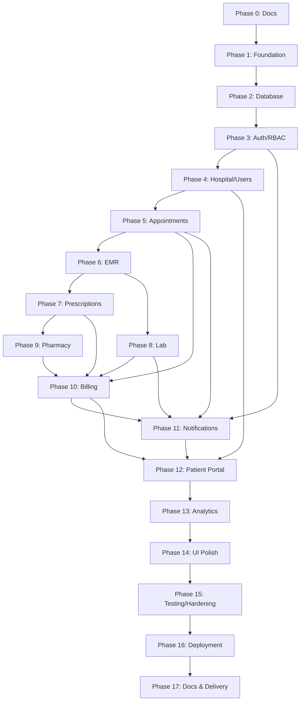

# Development Plan — MedCore HMS

**Version:** 1.0
**Status:** Approved for Phase 1
**Related documents:** all `docs/*.md`, `11-DECISIONS.md` D-001

## 1. Methodology

Implementation proceeds in 17 gated phases, each closing with a `PHASE-X-REVIEW.md` at status `PASS`, `PASS WITH DOCUMENTED MINOR ISSUES`, `BLOCKED`, or `FAIL`. No phase begins until the previous one's gate passes **and** the user explicitly instructs the next phase to start. This governs *process*; the brief's week-by-week grouping governs *scope grouping* and is preserved below as a mapping, not as a calendar (`11-DECISIONS.md` D-001).

Each phase follows the same execution sequence: restate objective → list requirements → identify dependencies → implement → test → security review → UI/UX review → architecture review → update docs → run the phase gate → stop.

## 2. Repository Structure

```
apps/
  frontend/          # Next.js 15 app
  backend/           # NestJS app
packages/
  types/              # Shared TS interfaces/DTOs/enums (source of truth for API contracts)
  config/             # Shared ESLint/TS/Tailwind config
infrastructure/
  docker/             # Dockerfiles, compose files (dev + prod)
  nginx/              # nginx.conf, TLS config
  github/              # (workflows live in .github/workflows; this holds shared CI scripts)
docs/                 # This documentation set
scripts/               # One-off dev/ops scripts (seed, migration helpers)
tests/                 # Playwright E2E specs (cross-app; unit/integration tests live beside their app)
```

pnpm workspaces tie `apps/*` and `packages/*` together; `packages/types` is imported by both apps so a DTO change is a single source edit, never a manually-synced duplicate.

## 3. Phase Roadmap

Each phase lists: scope, primary FR/NFR/SEC IDs it delivers, and its gate criteria beyond the universal ones (tests pass, lint/type-check/build pass, docs updated, no critical defect).

### Phase 0 — Discovery & Documentation *(this phase)*
Deliverables: all files in `docs/`. No application code. Gate: all 11 planning docs + decision log complete and internally consistent; user approves start of Phase 1.

### Phase 1 — Repository, Tooling & Infrastructure Foundation
Monorepo scaffold, TypeScript strict mode, ESLint/Prettier shared config, Docker Compose (postgres, redis, api, frontend, nginx), `.env.example`, base NestJS app with `HealthModule`, base Next.js app, `packages/types` skeleton, GitHub Actions CI skeleton (lint/typecheck/build), structured logging (Pino) wired.
Delivers: `NFR-OBS-001`, `NFR-AVAIL-001`.
Extra gate: `docker compose up` produces a working empty stack; CI runs green on an empty diff.

### Phase 2 — Database & Core Architecture
Full Prisma schema from `06-DATABASE-DESIGN.md`, migrations, `btree_gist` extension + exclusion constraints, seed script skeleton, Prisma Client Extension for tenant scoping and audit logging.
Delivers: `FR-TENANT-001/002`, schema portions of `FR-HOSP/APPT/EMR/RX/LAB/PHARM/BILL/NOTIF`.
Extra gate: `prisma migrate dev` clean from empty DB; ER diagram regenerated and matches `06-DATABASE-DESIGN.md`.

### Phase 3 — Authentication, Sessions & RBAC
`AuthModule`: register/login/refresh/logout/verify-email/verify-phone/forgot-reset-password, refresh rotation + reuse detection, `RolesGuard`, `TenantScopeGuard`, rate limiting on auth routes.
Delivers: `FR-AUTH-001..008`, `FR-RBAC-001/002`, `FR-TENANT-003`, `SEC-AUTHN-*`.
Extra gate: refresh-reuse-detection test and cross-tenant test both pass in CI.

### Phase 4 — Hospital, Users, Departments & Profiles
Hospital onboarding/verification, department CRUD, staff account provisioning, doctor/patient profile setup, Address model reuse.
Delivers: `FR-HOSP-001..003`.

### Phase 5 — Appointments & Scheduling
Availability + exceptions, slot computation, booking with exclusion-constraint protection, status lifecycle state machine, emergency bypass, BullMQ reminder jobs.
Delivers: `FR-APPT-001..007`.
Extra gate: concurrent double-booking test (§`10-TESTING-STRATEGY.md`) passes.

### Phase 6 — EMR & Clinical Workflow
Encounter creation, vitals, diagnosis, allergies/vaccination/family history, addenda (append-only enforcement), attachments via S3 pre-signed URLs.
Delivers: `FR-EMR-001..007`.

### Phase 7 — Prescriptions
Medicine search against inventory, prescription creation, PDF generation via Puppeteer, doctor signature overlay.
Delivers: `FR-RX-001..003`.

### Phase 8 — Laboratory
Test catalog + reference ranges, order lifecycle, structured result entry, four-eyes approval, out-of-range flagging, notification triggers.
Delivers: `FR-LAB-001..005`.

### Phase 9 — Pharmacy
Batch inventory, FIFO-by-expiry dispensing, quarantine job, low-stock alerts, nightly expiry digest.
Delivers: `FR-PHARM-001..005`.
Extra gate: expired-batch dispensing rejection test passes.

### Phase 10 — Billing & Payments
Invoice aggregation across modules, finalisation, Stripe + Razorpay test-mode checkout, signed webhook handling, cash payments, receipts.
Delivers: `FR-BILL-001..006`.
Extra gate: invoice-total-integrity test and webhook-signature-rejection test pass.

### Phase 11 — Notifications & Background Jobs
Event bus, per-channel queues/workers, Socket.IO gateway with Redis adapter, delivery logging, Bull Board (dev-only).
Delivers: `FR-NOTIF-001..003`, `NFR-AVAIL-002/003`.

### Phase 12 — Patient Portal
Patient-scoped views over appointments/records/prescriptions/lab reports/invoices, self-service booking and payment.
Delivers: `FR-PORTAL-001..003`.

### Phase 13 — Analytics & Dashboards
Role-specific dashboards (Recharts), global search, filters, pagination.
Delivers: `FR-ANALYTICS-001`, `FR-SEARCH-001`.

### Phase 14 — UI/UX Polish
Design-system refinement pass across all screens against the `04-UI-UX.md` §9 checklist, responsive/accessibility pass, animation audit, performance pass (bundle size, render cost).
Delivers: `NFR-A11Y-*`, `NFR-PERF-003`.

### Phase 15 — Testing & Hardening
Full testing-pyramid pass (unit/integration/component/E2E), all nine mandatory scenarios from the brief verified in CI, security review pass (OWASP checklist), dependency audit.
Delivers: remaining `SEC-*` verification, `10-TESTING-STRATEGY.md` full coverage.

### Phase 16 — Deployment & DevOps
Production Docker Compose, Nginx TLS config, full GitHub Actions pipeline (PR checks → main build → tag deploy), AWS EC2/RDS/S3 provisioning, Vercel frontend deploy, Sentry production wiring, health-check-gated blue-green cutover.
Delivers: `NFR-AVAIL-001`, deployment architecture from `03-ARCHITECTURE.md` §11/15.

### Phase 17 — Documentation & Delivery
README with setup + demo credentials, Swagger finalised, ER/architecture diagrams exported, project report, video walkthrough, final phase-gate review of the whole system.

## 4. Dependency Graph (Coarse)



## 5. Phase Gate Checklist (applies to every phase)

- [ ] All requirements listed for the phase are implemented
- [ ] Acceptance criteria satisfied
- [ ] Unit/integration tests written and passing for new code
- [ ] `tsc --noEmit` passes on both apps
- [ ] ESLint passes with zero errors (warnings triaged, not silently ignored)
- [ ] `docker compose build` succeeds
- [ ] No known critical defect remains open
- [ ] Security checklist items relevant to the phase reviewed (`09-SECURITY.md`)
- [ ] UI/UX checklist reviewed for any new screens (`04-UI-UX.md` §9)
- [ ] Architecture remains consistent with `03-ARCHITECTURE.md`, or that document is updated to reflect an intentional change
- [ ] Relevant docs updated (SRS status, API contract, decisions log if applicable)
- [ ] `PHASE-X-REVIEW.md` written with final gate status

A phase is never marked `PASS` with a known critical defect outstanding; it is marked `BLOCKED` or `FAIL` instead, with the blocking issue named explicitly.
