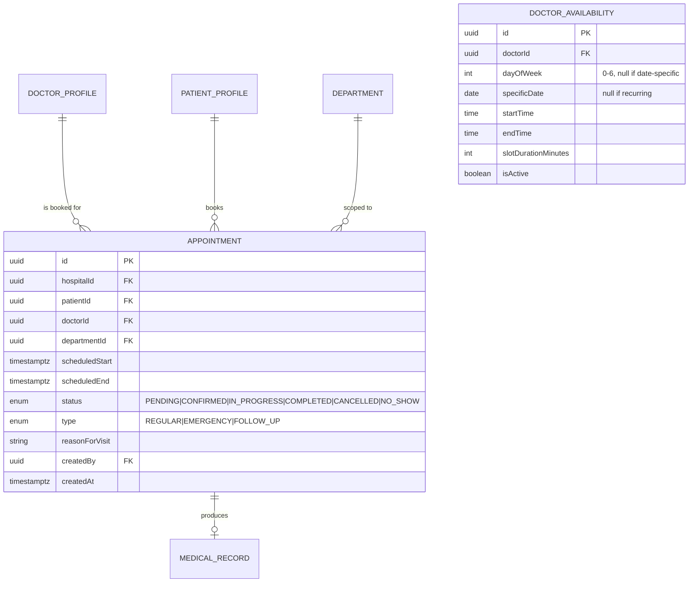
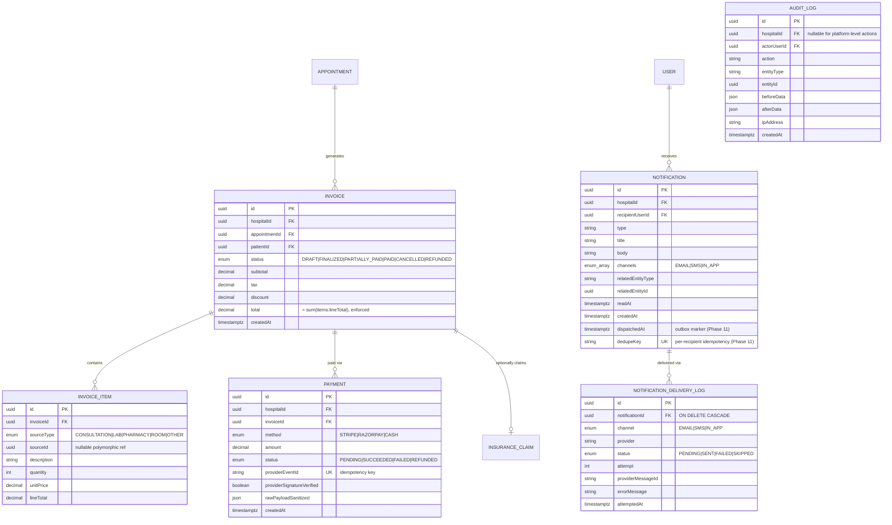

# Database / ER Design — MedCore HMS

**Version:** 1.0
**Status:** Approved for Phase 2
**Related documents:** `03-ARCHITECTURE.md` §4–5, §8, `11-DECISIONS.md` D-002, D-004, D-005, D-006

## 1. Design Principles

- Normalised to 3NF; no repeated-group columns, no JSON used as a substitute for a proper relation (JSON is used only for genuinely schemaless data: structured lab result parameters, sanitised webhook payloads, before/after audit diffs).
- Every hospital-scoped table carries `hospitalId` — a table without one is either global (Hospital itself, platform-level lookups) or explicitly justified below.
- Soft delete (`deletedAt timestamptz null`) on entities with legal/clinical retention requirements: `User`, `Patient`, `DoctorProfile`, `Appointment`, `Medicine`. Everything else may hard-delete only if it has no clinical or financial history dependency.
- Every table has `id` (UUID, default `gen_random_uuid()`), `createdAt`, `updatedAt`; timestamps are `timestamptz`, never naive.
- Minimum indexing rule (per brief §5 hint): `hospitalId`, `patientId`, `doctorId`, and any date/status column that appears in a `WHERE` clause are indexed. Composite indexes are added for the specific hot queries named per-entity below.

## 2. Core Entity Relationships (Summary Table)

| Entity         | Relates To                                 | Relationship                                                       |
| -------------- | ------------------------------------------ | ------------------------------------------------------------------ |
| Hospital       | User, Department, Room                     | One Hospital → Many                                                |
| User           | Role (enum), Hospital                      | Many Users → One Hospital (nullable for Super Admin)               |
| DoctorProfile  | User, Department, Appointment              | One-to-One with User                                               |
| PatientProfile | User, Hospital                             | One-to-One with User (nullable User for guest-registered patients) |
| Appointment    | DoctorProfile, PatientProfile, Department  | Many-to-One each                                                   |
| MedicalRecord  | Appointment, PatientProfile, DoctorProfile | One Appointment → One Record                                       |
| Prescription   | MedicalRecord, Medicine                    | Many-to-Many via PrescriptionItem                                  |
| LabOrder       | MedicalRecord, LabTest                     | One Record → Many Orders                                           |
| Invoice        | Appointment, PatientProfile                | One Appointment → One Invoice                                      |
| InvoiceItem    | Invoice, (Lab/Pharmacy/Consult)            | Many-to-One Invoice                                                |
| Notification   | User, (linked entity)                      | Polymorphic recipient                                              |
| AuditLog       | User, any entity                           | All write operations logged                                        |

## 3. Entity Groups & Diagrams

Grouped into five diagrams for legibility rather than one unreadable 30-entity graph — this mirrors how the Prisma schema file itself is organised into sections.

### 3.1 Identity, Tenancy & Staff

```mermaid
erDiagram
    HOSPITAL ||--o{ DEPARTMENT : has
    HOSPITAL ||--o{ USER : employs
    HOSPITAL ||--o| ADDRESS : "located at"
    DEPARTMENT ||--o{ DOCTOR_PROFILE : contains
    USER ||--o| DOCTOR_PROFILE : "is a"
    USER ||--o| PATIENT_PROFILE : "is a"
    USER ||--o| STAFF_PROFILE : "is a"
    DOCTOR_PROFILE ||--o{ DOCTOR_AVAILABILITY : defines
    DOCTOR_PROFILE ||--o{ DOCTOR_AVAILABILITY_EXCEPTION : defines
    PATIENT_PROFILE ||--o| ADDRESS : "located at"
    USER ||--o{ REFRESH_TOKEN_SESSION : owns
    DEPARTMENT ||--o{ ROOM : contains
    ROOM ||--o{ BED : contains

    HOSPITAL {
        uuid id PK
        string name
        string slug UK
        enum status "PENDING_VERIFICATION|ACTIVE|SUSPENDED"
        uuid addressId FK
        string contactEmail
        string timezone
        timestamptz createdAt
    }
    USER {
        uuid id PK
        uuid hospitalId FK "nullable, null only for SUPER_ADMIN"
        string email UK
        string phone
        string passwordHash
        enum role "9 roles"
        enum status "ACTIVE|DISABLED|PENDING"
        timestamptz emailVerifiedAt
        timestamptz phoneVerifiedAt
        timestamptz deletedAt
    }
    DOCTOR_PROFILE {
        uuid id PK
        uuid userId FK UK
        uuid hospitalId FK
        uuid departmentId FK
        string specialization
        string licenseNumber
        decimal consultationFee
        string signatureImageUrl
        timestamptz deletedAt
    }
    PATIENT_PROFILE {
        uuid id PK
        uuid userId FK "nullable — guest-registered patient"
        uuid hospitalId FK
        date dob
        enum gender
        string bloodGroup
        uuid addressId FK
        timestamptz deletedAt
    }
```

**Decision — `StaffProfile` vs. one table per role:** Nurse, Receptionist, Lab Technician, Pharmacist, Accountant, and Hospital Admin share one generic `StaffProfile` (employee code, department, join date) rather than six near-identical tables, because none of them carry meaningfully distinct structured attributes in this scope. Doctor and Patient get dedicated tables because their domain data is genuinely rich and distinct. See `11-DECISIONS.md` D-006.

### 3.2 Appointments & Scheduling



Indexes: `Appointment(hospitalId, scheduledStart)`, `Appointment(doctorId, scheduledStart)`, `Appointment(patientId, scheduledStart)`, `Appointment(hospitalId, status)`. Exclusion constraints for overlap prevention are defined in `03-ARCHITECTURE.md` §8 and live in the Prisma migration as raw SQL (Prisma does not have first-class `EXCLUDE` syntax).

### 3.3 Clinical Records & Prescriptions

```mermaid
erDiagram
    MEDICAL_RECORD ||--o{ MEDICAL_RECORD_ADDENDUM : "appended by"
    MEDICAL_RECORD ||--o{ VITALS : records
    MEDICAL_RECORD ||--o{ ATTACHMENT : includes
    MEDICAL_RECORD ||--o{ PRESCRIPTION : yields
    PATIENT_PROFILE ||--o{ ALLERGY : has
    PATIENT_PROFILE ||--o{ VACCINATION_RECORD : has
    PATIENT_PROFILE ||--o{ FAMILY_HISTORY_FLAG : has
    PRESCRIPTION ||--o{ PRESCRIPTION_ITEM : contains
    PRESCRIPTION_ITEM }o--|| MEDICINE : references
    PRESCRIPTION_ITEM ||--o{ DISPENSE_RECORD : "fulfilled by"
    DISPENSE_RECORD }o--|| MEDICINE_BATCH : "drawn from"

    MEDICAL_RECORD {
        uuid id PK
        uuid hospitalId FK
        uuid appointmentId FK UK
        uuid patientId FK
        uuid doctorId FK
        string chiefComplaint
        string presentingSymptoms
        string diagnosisNotes "free text, FR-EMR-004; added Phase 6 gap-fix"
        string_array confirmedDiagnosisIcd10
        text treatmentPlan
        bytea notesEncrypted "app-level AES-256-GCM, see 09-SECURITY.md"
        timestamptz createdAt "immutable after insert"
    }
    VITALS {
        uuid id PK
        uuid medicalRecordId FK
        int bpSystolic
        int bpDiastolic
        int pulse
        decimal temperatureC
        int spo2
        decimal heightCm
        decimal weightKg
        decimal bmi "server-computed"
        timestamptz recordedAt
    }
    PRESCRIPTION {
        uuid id PK
        uuid hospitalId FK
        uuid medicalRecordId FK
        uuid doctorId FK
        uuid patientId FK
        string signatureImageUrl "S3 key, snapshot at issue time"
        string pdfUrl "S3 key, not a public URL"
        enum status "ISSUED|PARTIALLY_DISPENSED|DISPENSED|CANCELLED"
        uuid supersedesId FK "nullable, unique; FR-RX-003 correction chain; added Phase 7 gap-fix"
        timestamptz createdAt
    }
    PRESCRIPTION_ITEM {
        uuid id PK
        uuid prescriptionId FK
        uuid medicineId FK
        string dosage
        enum frequency "OD|BD|TDS|QID|SOS|OTHER"
        int durationDays
        string specialInstructions
        int quantityPrescribed
        int quantityDispensed
    }
```

**Encryption note:** `MedicalRecord.notes` (and the addendum body) are encrypted at the application layer before insert, stored as `bytea`. See `09-SECURITY.md` §Data Encryption for the deviation from raw `pgcrypto` SQL functions and the reasoning (`11-DECISIONS.md` D-006... see D-008).

### 3.4 Laboratory & Pharmacy

```mermaid
erDiagram
    MEDICAL_RECORD ||--o{ LAB_ORDER : requests
    LAB_ORDER ||--o{ LAB_ORDER_ITEM : contains
    LAB_ORDER_ITEM }o--|| LAB_TEST : references
    LAB_ORDER_ITEM ||--o| LAB_RESULT : produces
    LAB_TEST ||--o{ LAB_TEST_REFERENCE_RANGE : "has ranges"
    MEDICINE ||--o{ MEDICINE_BATCH : "stocked as"

    LAB_ORDER {
        uuid id PK
        uuid hospitalId FK
        uuid medicalRecordId FK
        uuid doctorId FK
        uuid patientId FK
        enum priority "ROUTINE|URGENT"
        timestamptz createdAt
    }
    LAB_ORDER_ITEM {
        uuid id PK
        uuid labOrderId FK
        uuid labTestId FK
        enum status "ORDERED|SAMPLE_COLLECTED|IN_PROGRESS|RESULT_UPLOADED|APPROVED|REJECTED"
    }
    LAB_RESULT {
        uuid id PK
        uuid labOrderItemId FK UK
        json structuredValues "[{parameter,value,unit,flag}]"
        string reportFileUrl
        uuid enteredBy FK
        uuid approvedBy FK "must differ from enteredBy"
        timestamptz approvedAt
        boolean isOutOfRange
    }
    MEDICINE_BATCH {
        uuid id PK
        uuid medicineId FK
        uuid hospitalId FK
        string batchNumber
        date manufacturingDate
        date expiryDate
        int quantityOnHand
        decimal unitCost
        decimal mrp
        enum status "ACTIVE|QUARANTINED|DEPLETED"
    }
```

Indexes: `MedicineBatch(medicineId, expiryDate)` (drives FIFO-by-expiry selection), `MedicineBatch(hospitalId, status)`, `LabOrderItem(status)`, unique `(medicineId, batchNumber)`.

`Medicine.lowStockAlertedAt timestamptz null` (added Phase 9, migration `20260924090000_add_medicine_low_stock_latch`) is the FR-PHARM-004 once-per-crossing latch. It's set when a low-stock alert fires and cleared when available stock recovers to at least `reorderLevel` (`11-DECISIONS.md` D-022). "Available stock" everywhere means the sum of `quantityOnHand` over `ACTIVE` batches whose `expiryDate` is on or after the hospital's local today (D-023).

### 3.5 Billing, Notifications & Audit



`Invoice.total` integrity: enforced both by always recomputing it server-side on any item mutation (never accepting it from the client) and by a Postgres `CHECK`-adjacent safeguard — a trigger that recomputes and compares on `INVOICE_ITEM` write, rejecting drift. This gives the billing-integrity test (`10-TESTING-STRATEGY.md`) two independent layers to catch a regression in.

**As implemented in Phase 10** (migration `20260924120000_billing_integrity`, `11-DECISIONS.md` D-027/D-028):
- `Invoice.appointmentId` is no longer unique. A charge incurred after a visit's invoice is finalized opens a supplementary DRAFT invoice. "One DRAFT per appointment" is enforced under an `Appointment` row lock.
- CHECK constraints: `InvoiceItem.lineTotal = quantity × unitPrice`, `quantity > 0`; `Invoice.total = subtotal + tax − discount` with all three `≥ 0`; `Payment.amount > 0`.
- A deferred constraint trigger on `Invoice` and `InvoiceItem` verifies `subtotal = SUM(lineTotal)` at commit.
- A BEFORE trigger makes a non-DRAFT invoice's line items immutable. The only exception is appending a credit (negative) line while it's FINALIZED/PARTIALLY_PAID.
- New columns: `Invoice.finalizedAt`, `InvoiceItem.createdAt`, `Payment.recordedBy` (cash).
- `Payment.providerEventId` (unique) holds the provider's checkout reference (Stripe Checkout Session / Razorpay order id); see D-029.

**As implemented in Phase 11** (migration `20260925090000_notification_dispatch`, `11-DECISIONS.md` D-032):
- `Notification` is the transactional outbox. `dispatchedAt` is null until the dispatcher has enqueued its per-channel jobs, and `dedupeKey` (unique) makes a repeated trigger a no-op. Rows written before the migration are marked dispatched so they're never sent retroactively.
- Indexes: `(recipientUserId, createdAt)` serves `GET /notifications/me`; `(dispatchedAt, createdAt)` serves the outbox drain and sweep.
- `NotificationDeliveryLog` records one row per delivery attempt (`attempt`, `providerMessageId`), with the new `SKIPPED` status. Its FK to `Notification` is now `ON DELETE CASCADE`, since a log has no meaning without its notification.

## 4. Key Design Decisions

- **Doctor availability model:** recurring weekly pattern (`DoctorAvailability`, keyed by `dayOfWeek`) plus a small `DoctorAvailabilityException` table for date-specific overrides (leave, holidays, one-off extra hours) — not individually materialised slot rows. Slots are computed on read (cheap, cacheable) rather than pre-generated and stored, which would require a background job to keep in sync and would explode row counts. Trade-off accepted and documented in `11-DECISIONS.md` D-009.
- **Prescription ↔ Medicine many-to-many:** resolved via `PrescriptionItem`, which is where dosage/frequency/duration/instructions live — exactly as the brief's hint frames it.
- **Lab results:** hybrid, per the brief's suggested options — structured `parameter/value/unit/flag` JSON array for values the system can range-check automatically, plus an optional `reportFileUrl` for a PDF/scan when a structured breakdown isn't practical (e.g. imaging-adjacent reports). This is the hybrid approach the brief explicitly calls out as a valid design.
- **Soft delete scope:** limited to `User`, `Patient`, `DoctorProfile`, `Appointment`, `Medicine` — entities with legal/clinical/financial retention weight. Other tables use hard delete or retention-by-policy where soft delete would add no value.
- **`AuditLog.actorUserId` is nullable**, representing system-triggered writes (seed scripts, background jobs) with no human actor — distinct from `hospitalId` being nullable, which represents platform-level (Super Admin) actions with no tenant.
- **Address reuse:** one `Address` table referenced by `Hospital` and `PatientProfile` (and future supplier records), rather than embedded address columns duplicated per table, per the brief's explicit hint.

## 5. Migration & Seed Strategy

- Prisma migrations are the only path to schema change; no manual DDL against a shared environment.
- The `btree_gist` extension and the two `EXCLUDE` constraints are added via a Prisma migration's `migration.sql`, since Prisma's schema DSL has no native syntax for exclusion constraints.
- Seed script (`scripts/seed.ts`) creates ≥2 hospitals, ≥8 doctors across specialisations, ≥30 patients, and two weeks of realistic appointment/EMR/prescription/lab/billing history per the brief's own demo-data guidance, using a fixed faker seed for reproducibility.
